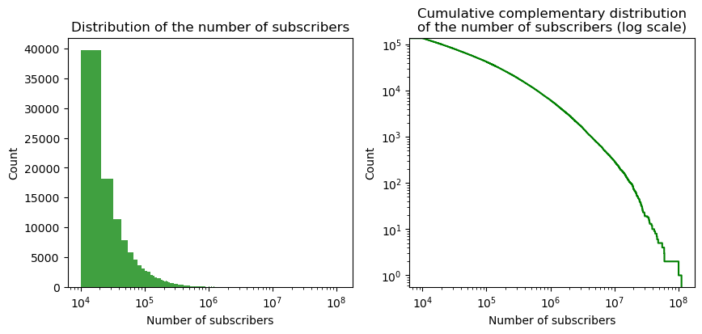
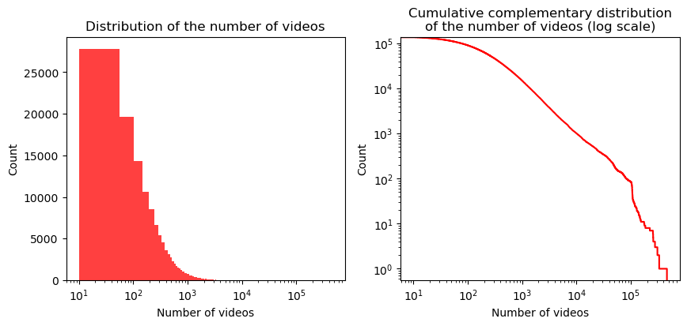
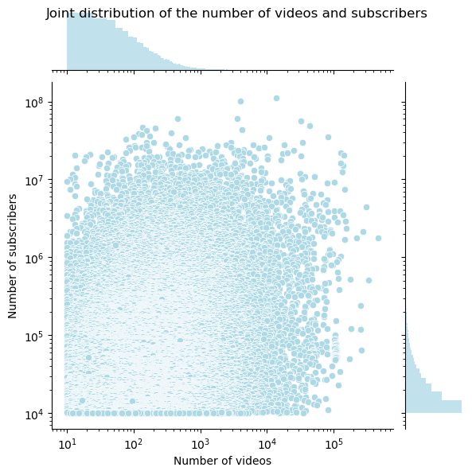
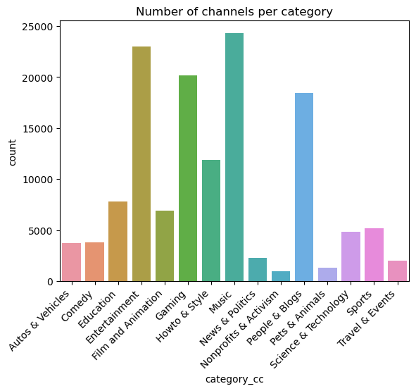
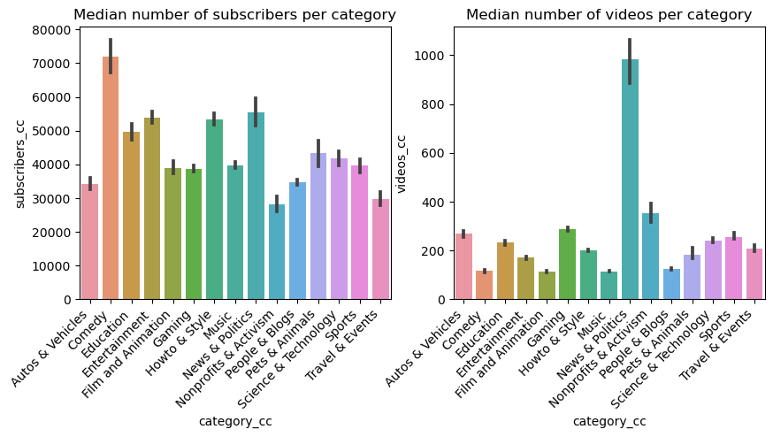
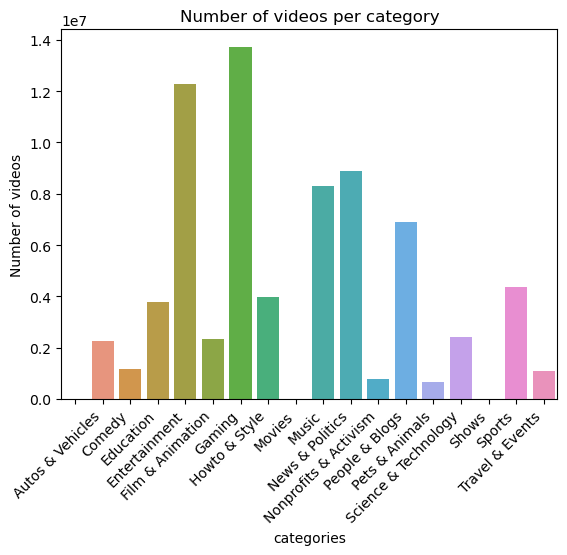
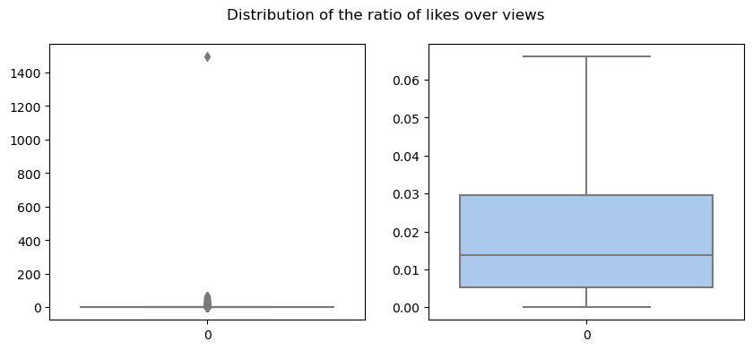
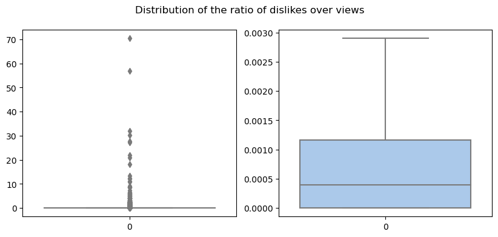

The YouNiverse dataset is a large-scale channel and video metadata from English-speaking YouTube. It contains several files with information about YouTube channels and videos. Specifically, in our project we used:  
- `df_channels_en.tsv.gz`: contains data related to channels. It aggregates both basic stats from channels obtained from `channelcrawler.com`, as well as rankings obtained from `socialblade.com`
- `df_timeseries_en.tsv.gz`: contains data related to time series, with a data point for each channel and each week.
- `yt_metadata_en.jsonl.gz`: contains metadata data related to ~73M videos from ~137k channels.  

 biased di partenza per il nostro tipo di analisi perchè non ci sono i canali con meno iscritti quindi dato che è più probabile osservare il nostro behavior nei canali piccoli perché non acquisiscono iscritti.  
    
Here, we visualize some characteristics of these dataframes.  

## Channels' dataframe
First of all, only channels with more than 10k subscribers and 10 videos are present. Below, we can observe their distribution of subscribers and videos, which in both cases is highly skewed. Indeed, most channels have less than $10e5$ subscribers and 1000 videos. Both distribution might resemble a power-law, but from the CDF plot we can reject this hypothesis. However, between 100 and 50k videos, the graph is almost linear, which suggest that the distribution could be a power-law in this range. 

Moreover, if we compare the distributions of videos and subscribers, the scatter plot shows that there is a lot of variability within comparison.  

  

<!--  -->

Also, the distribution of the number of channels per category is shown below. It is clear that the most represented channel categories in the dataset are Entertainment, Music, Gaming, and People & Blogs.  

  

To better observe how the data is represented across categories, the distributions of the medians of the number of channel subscribers and of the number of videos in each category can be analyzed. As we can see, the category with the most subscribers is Comedy, while News & Politics channels post the most videos.

  

## Time series' dataframe

## Metadata's dataframe

For this dataframe, we can start by looking at the number of videos per category.  

  

If we compare this distribution with the one of the channels' dataframe, we can see that the most represented categories are fairly the same, but the distribution is different. Indeed, the most represented categories are still Entertainment and Gaming, followed by News & Politics, Music, and People & Blogs. Additionally, two new categories appear in the `yt_metadata_en.jsonl.gz` file: Movies and Shows.

To further characterize the dataset, we can look at the distribution of likes. To be able to compare the likes and dislikes across different videos (since they varied significantly), we decided to normalize the number of likes (or dislikes) by the number of views. The general distribution of the normalized number of likes and dislikes is shown below. 

  
   

The first thing to notice is that some videos (outliers) have a higher number of appreciation indexes compared to the views they obtained. This result highlights that there are inconsistencies in the dataset.  

[back](./)
