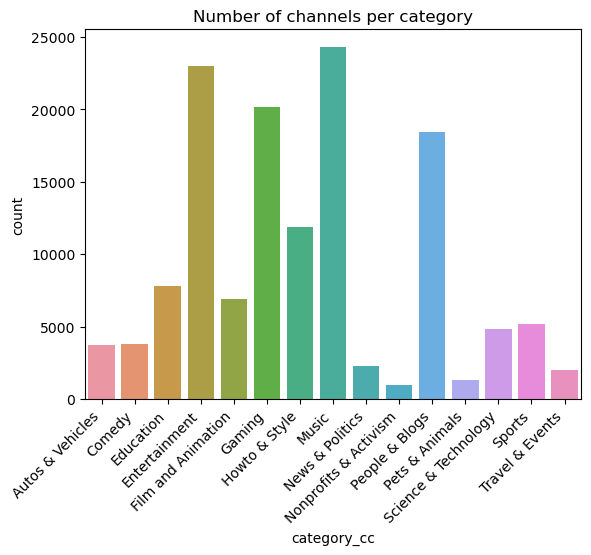
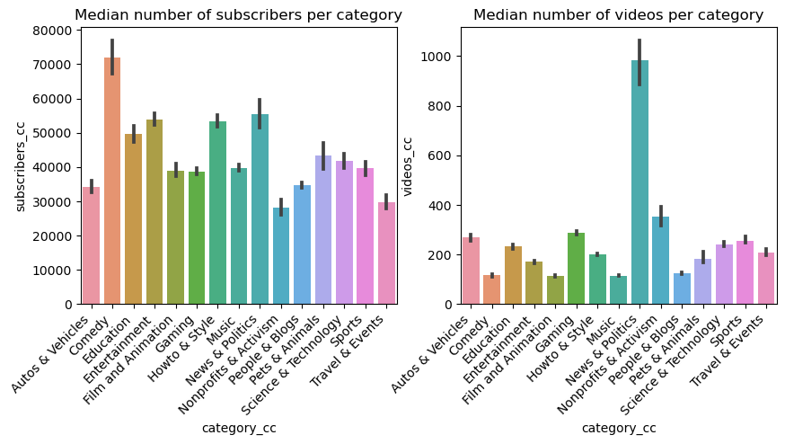
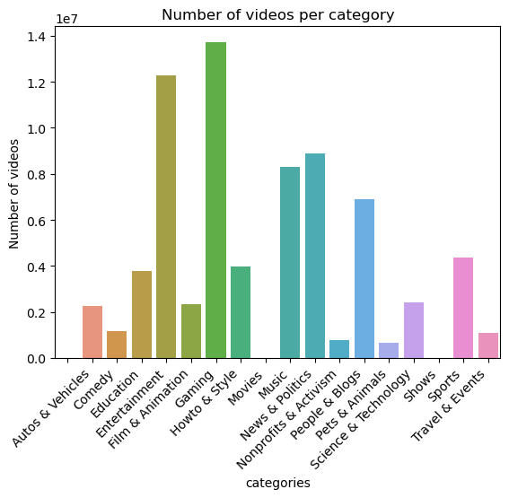
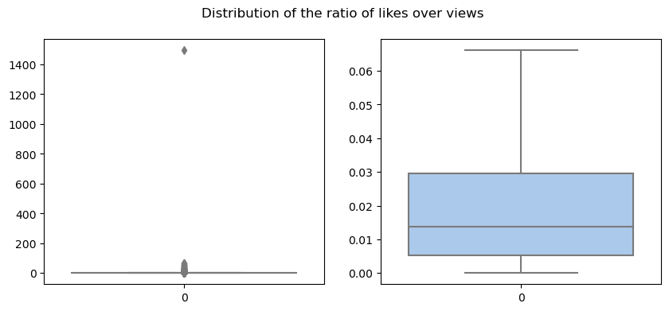

The YouNiverse dataset is a large-scale channel and video metadata from English-speaking YouTube. It contains several files with information about YouTube channels and videos. Specifically, in our project we used:  
- `df_channels_en.tsv.gz`: contains data related to channels. It aggregates both basic stats from channels obtained from `channelcrawler.com`, as well as rankings obtained from `socialblade.com`
- `df_timeseries_en.tsv.gz`: contains data related to time series, with a data point for each channel and each week.
- `yt_metadata_en.jsonl.gz`: contains metadata data related to ~73M videos from ~137k channels.  

We want to point out, that the channels with less than 10k of subscribers and less than 10 videos are discarded, and this could bias our analysis. Indeed, a small channel could be more prone to rapidly gain popularity without gaining subscribers accordingly. Having the data about these types of channels could increase our population of channels who lost fame after going viral, also with respect to that of long-term successful channels.
    
Here, we visualize some characteristics of our dataframe.  

## Channels' dataframe
First of all, as previously mentioned, only channels with more than 10k subscribers and 10 videos are present. Below, we can observe their distribution of subscribers and videos, which in both cases is highly skewed. Indeed, most channels have less than $10e5$ subscribers and 1000 videos. Both distribution might resemble a power-law, but from the CDF plot we can reject this hypothesis. However, between 100 and 50k videos, the graph is almost linear, which suggest that the distribution could be a power-law in this range. 

Moreover, if we compare the distributions of videos and subscribers, the scatter plot shows that there is a lot of variability within comparison.  

  

<!--  -->

Also, the distribution of the number of channels per category is shown below. It is clear that the most represented channel categories in the dataset are Entertainment, Music, Gaming, and People & Blogs.  

  

To better observe how the data is represented across categories, the distributions of the medians of the number of channel subscribers and of the number of videos in each category can be analyzed. As we can see, the category with the most subscribers is Comedy, while News & Politics channels post the most videos.

  

## Time series' dataframe

This dataset contains the observations of the channels over time. Here a sample of five channels was chosen for visualization purposes. We can notice how channels weren't observed for the same amount of time, and how the initial and final date of observations wasn't the same. 

  

## Metadata's dataframe

For this dataframe, we can start by looking at the number of videos per category.  

  

If we compare this distribution with the one of the channels' dataframe, we can see that the most represented categories are fairly the same, but the distribution is different. Indeed, the most represented categories are still Entertainment and Gaming, followed by News & Politics, Music, and People & Blogs. Additionally, two new categories appear in the `yt_metadata_en.jsonl.gz` file: Movies and Shows.

To further characterize the dataset, we can look at the distribution of likes. To be able to compare the likes and dislikes across different videos (since they varied significantly), we decided to normalize the number of likes (or dislikes) by the number of views. The general distribution of the normalized number of likes and dislikes is shown below. 

  
   

The first thing to notice is that some videos (outliers) have a higher number of appreciation indexes compared to the views they obtained. This result highlights that there are inconsistencies throughout the dataset. Another example of this, is the fact that some of the videos are missing their category.  

Moreover, the distribution of the normalized likes and dislikes across categories are visualized in the heatmaps below. Overall, most categories receive likes corresponding to the 1/5% of views that they obtain, while dislikes are less then 0.1%. 

  
   

Lastly, we can study the distribution of the number of views across categories (the values used for the heatmap below are the proportion of the number of videos per category in each views class with respect to the total number of videos in the same category). Overall, most videos in all categories received views between 1k and 10k, with exceptions for videos belonging to Movies and Shows. This can be due to the fact that there are only few videos in these, therefore the distribution might be under sampled. Also, News & Politics videos received a little bit less views per video. 

  

## Comparison between the distributions of channels' and videos' categories 

Both videos in `yt_metadata_en.jsonl.gz` and channels in `df_channels_en.tsv.gz` have categories assigned, therefore we visualize their distributions here. 

  

We can observe that most of the channels belonging to a category, also publish videos of the same. However, some variability is present as well. For example, channels in all categories, post also videos belonging to the People & Blogs one, while in videos from People & Blogs channels, also Entertainment, Gaming, and Howto & Style categories are represented. 

[back](./)
