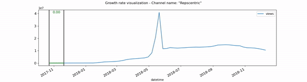

Firstly, we discarded all the channels that had an observation period shorter than one year. Then,through a sliding window of 5 datapoints we were able to define a metric called **"growth_rate"**. This metric was used later to identify the channels with the fastest growth and the date of their peak in terms of visibility gain. It captures the rate of increase (or decrease) in terms of growth for each channel during the 5 weeks considered within the window. A high "growth_rate" means that the datapoint considered is associated to a rapid increase in the previous month, while a negative value to a fast decrease. For its calculation, we compared the views curve to a linear interpolation between the ends of the window by computing the area between the two curves. Next, we computed the difference between the maximum and the minimum views for each channel. We then normalized the growth rate over this value to obtain a variable between 0 and 1. Normalization was applied in the interest of making comparisons possible. It's relevant to note that the first 12 and the last 14 datapoints of each channel period of observation were not considered for the computation of this metric. This choice allowed us to avoid selecting channels that displayed a peak in views at the end of their timeseries, where the lack of information after the spike could have been a source of bias. The metric best illustrated in the following animation:

<figure>
  
  <figcaption align="center" style="font-weight: lighter">
    <b>the linear interpolation is colored in red when the metric is invalid because of the views curve shape</b>
  </figcaption>
</figure>

[back](./)