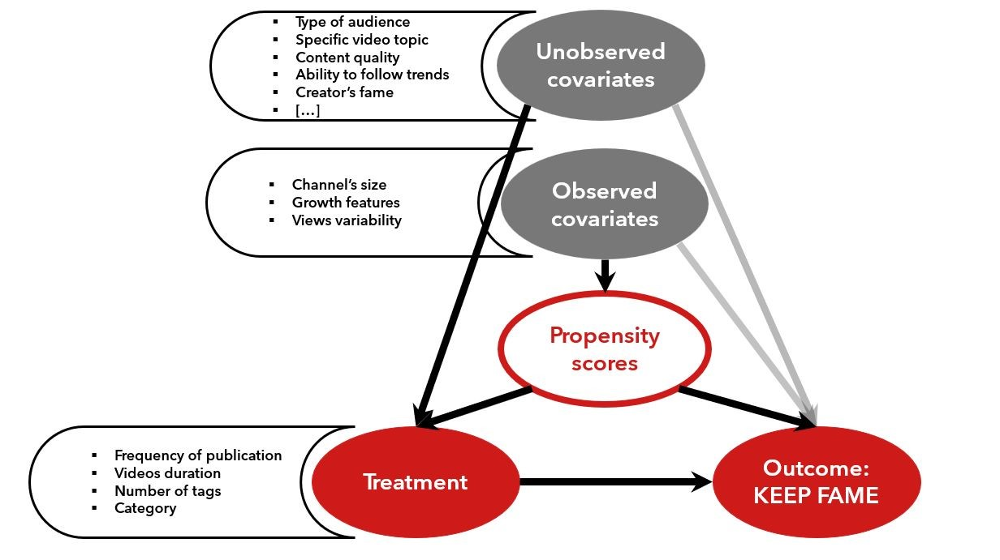
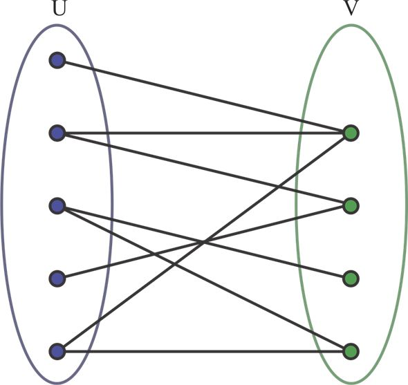

The **YouNiverse** dataset is composed of what we call "found data": data that was collected for another purpose and that we are using for our analysis. As this is a very common practice in data science, and it is often the case that the data is not perfectly suited for the task at hand. In our analysis we want to compare two distinct populations (**keep fame** and **lose fame**) of channels, and we want to understand what are the features that distinguish them. Since we want to determine which factors have an impact on the ability of a channel to maintain its fame and because the data does not originate from a controlled experiment (i.e. we cannot control the factors that influence the fame of a channel), we need techniques suited for observational studies to do our analysis. In particular we need to make sure that the two populations are comparable and that the data is not biased. This is where the propensity score matching comes in. The following causal diagram illustrates the problem we are trying to solve:

We are aware that this is a very simplified representation of the problem, but it is enough to understand the intuition behind the propensity score matching. The problem is that the two populations are not comparable, and that the data is biased by the confounding factors. Through our dataset, we can observe a set of "measurable" features (such as the number of subscribers, the number of videos, the number of views, etc.) that we can use to compare the two populations. However, we are not able to observe the unmeasurable features (such as the quality of the content, the personality of the creator, the quality of the videos, etc.) that could influence the fame of a channel. The former are called "observed covariates", while the latter are the "unobserved covariates". Both of them act as confounding factors on the treatment. To mitigate this effect, we calculated the channel's propensity score: a measure of the likelihood of a channel to receive the treatment (i.e. to be in the **keep fame** population). To compute the propensity scores we used a logistic regression model trained on a balanced subsample of the two populations obtained after preprocessing and filtering. Using the similarity as a measure of the connection weight between two channels in a potential pairing, we created a bipartite graph (see figure) that connected each channel in the **lose fame** population to all the channels in the **keep fame** group that belong to the same channel category. This way the two populations become comparable, and that the data is not biased by the observed confounding factors considered. However, we are aware that the unobserved covariates play a relevant and significant role in the channel's success. The following figure illustrates the process of propensity score matching on a bipartite graph:

  

[back](./)
